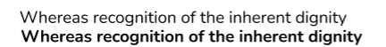
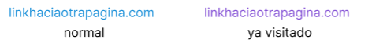

= Memoria del proyecto

== Introducción
Los miembros del proyecto somos Brian Tobias Arrua, Galindo Palacio Joan y Camilo Jumelle. Este proyecto tratará de realizar una aplicación que 

== Requisitos del proyecto

=== Sprint 1

== Seguimiento semanal
// Actualizar cada viernes con descripción y valoración

== Diseño

=== Diseño de BD
**Este es el primer diseño de la base de datos**

image::imatges/BD/primerDiagrama.png[]

**Explicación de las tablas**

** [underline]#Esdeveniment:# 
** [underline]#Categoria:#
** [underline]#Recinte:#
** [underline]#Sessio:# 
** [underline]#Tipus Entrada:# 
** [underline]#Compra:# 
** [underline]#Entrada:# 

=== Diagrama per classes

=== Sketching  

=== Mockup de interfaces

=== Guía de estilos

Para la página seguimos elegimos la siguiente ** paleta de colores ** , hemos decidido estos ya que llaman la atención
 y el contraste con el negro (que sera el color del texto) no obliga al usuario a forzar la vista. 

La ** tipografía ** elegida fue 'Nunito' se selecciono por su fácilidad lectora

Los ** iconos ** elegidos son los siguientes: +

El icono para busquedas

El icono para filtrar

Los ** botones ** serán de este estilo: 

image::imatges/GuiaEstils/botones.png[]

Los ** enlaces ** serán de la siguiente forma: 

== Confección del manual de instalación/distribución de la aplicación

== Confección del manual de usuario integrado en la aplicación

== Linias futuras

== Concluciones 

== Glosario

== Presentación del proyecto
