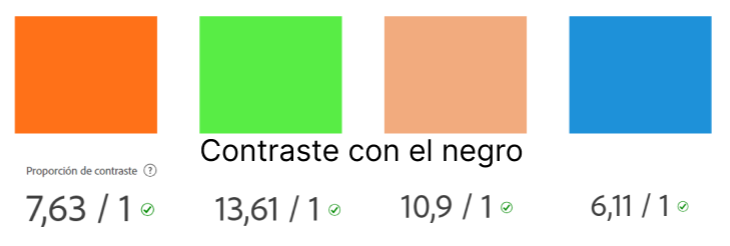

= ShowTickt
:Author: Brian Tobias Arrua, Joan Galindo, Camilo Jumelle
:doctype: book
:encoding: utf-8
:lang: ca
:toc: right
:numbered:

= Memoria del proyecto

== Introducción

Los miembros del proyecto somos Brian Tobias Arrua, Galindo Palacio Joan y Camilo Jumelle. Este proyecto tratará de realizar una aplicación que venderá entradas para eventos de varios
tipos, este proyecto incluye una sección de promotores donde el promotor deberá ir añadiendo y adminsitrando los eventos a vender.

== Diseño
    

=== Diagrama entitat relacio
**La siguiente imagen es el primer diseño de la base de datos**

image::images/BD/primerDiagrama.png[] 

**Esta imagen es un redieño del primer diagrama**

Hicimos este cambio principalmente por que en el primero no especificamos cual era la tabla fuerte y la tabla debil en "Esdeveniment, categoria y recinte"

 

**Este es el Diagrama Actualizado**

Añadimos las tablas de usuario, y colocamos bien sus atributos. 

=== Diagrama per classes
**Este es el primer diagrama de la base de datos modelo por clases**

////
[plantuml,file="diagramaBD"]
....
class esdeveniments{
 id:int
 nom:string
 dia:date
 imatge:string
 preu:decimal
 recinte()
 categoria()
}
    class categories{
id:int
tipus:enum[social,cultural,esportiu,altres]
esdeveniments()
}

class recintes{
id:int
nom:string
lloc:string
esdeveniments()
}   
class sessio{

}

class tipusEntrada{

}
class compra{
}

class entrada{

}

esdeveniments "n"-->"1" categories
esdeveniments "n"-->"1" recintes    
esdeveniments "1"-"1..n" sessio:\t
sessio  "1"-"1..n"  tipusEntrada:\t
sessio  "1"--"n"  compra
compra "1"-"n" entrada:\t  

....
////

image::images/diagramaBD.png[] 

**Explicación de las clases**

** [underline]#Esdeveniment:# La tabla de esdeveniments es la tabla que nos guarda los diferentes eventos que tenemos en la pagina, donde guardamos el nombre,el dia,la imagen y el precio
** [underline]#Categoria:# En la tabla de categoria hemos decidido guardar las diferentes categoria de los events
** [underline]#Recinte:# En la tabla de recinte hemos decidido guardar los recintos de los eventos
** [underline]#Sessio:# 
** [underline]#Tipus Entrada:# 
** [underline]#Compra:# 
** [underline]#Entrada:# 

=== Sketching  

=== Mockup de interfaces

=== Guía de estilos

Para la página seguimos elegimos la siguiente ** paleta de colores ** , hemos decidido estos ya que llaman la atención
 y el contraste con el negro (que sera el color del texto) no obliga al usuario a forzar la vista.
 

La ** tipografía ** elegida fue 'Nunito' se selecciono por su fácilidad lectora

image::images/GuiaEstils/tipografia.png[]

Los ** iconos ** elegidos son los siguientes: +

El icono para busquedas

image::images/GuiaEstils/iconoBusqueda.png[]

Los ** botones ** serán de este estilo: 

image::images/GuiaEstils/botones.png[]

Los ** enlaces ** serán de la siguiente forma: 

=== MetaDades y compartición a las redes sociales

Para poder controlar el compartir de las páginas de nuestra aplicación hemos añadido un meta de descripcion para que se coloque una breve descripción de lo que la página realiza
o muestra, y si la página es muestra algún evento a vender o demás mostrara también la imagen principal de este evento.

[source, html]
----
<meta name="description" content="descripción de la página" >
<meta name="image" content="imagen de evento si es que la página tiene">
----

== Confección del manual de instalación/distribución de la aplicación

include::isard.adoc[]

== Confección del manual de usuario integrado en la aplicación

== Linias futuras

== Concluciones 

== Glosario

== Presentación del proyecto
