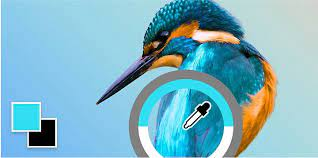

= ShowTickt
:Author: Brian Tobias Arrua, Joan Galindo, Camilo Jumelle
:doctype: book
:encoding: utf-8
:lang: es
:toc: center
:numbered:

= Memoria del proyecto

== Introducción
Los miembros del proyecto somos Brian Tobias Arrua, Galindo Palacio Joan y Camilo Jumelle. Este proyecto tratará de realizar una aplicación que 

== Requisitos del proyecto

=== Sprint 1

== Seguimiento semanal
// Actualizar cada viernes con descripción y valoración

== Diseño

=== Diseño de BD
**Este es el primer diseño de la base de datos**

[plantuml,file="diagramaBD"]
....
class esdeveniments{
 id:int
 nom:string
 dia:date
 imatge:string
 preu:decimal
 recinte()
 categoria()
}
    class categories{
id:int
tipus:enum[social,cultural,esportiu,altres]
esdeveniments()
}

class recintes{
id:int
nom:string
lloc:string
esdeveniments()
}   
class sessio{

}

class tipusEntrada{

}
class compra{
}

class entrada{

}

esdeveniments "n"-->"1" categories
esdeveniments "n"-->"1" recintes    
esdeveniments "1"-"1..n" sessio:\t
sessio  "1"-"1..n"  tipusEntrada:\t
sessio  "1"--"n"  compra
compra "1"-"n" entrada:\t  

....

**Explicación de las tablas**

** [underline]#Esdeveniment:# La tabla de esdeveniments es la tabla que nos guarda los diferentes eventos que tenemos en la pagina, donde guardamos el nombre,el dia,la imagen y el precio
** [underline]#Categoria:# En la tabla de categoria hemos decidido guardar las diferentes categoria de los events
** [underline]#Recinte:# En la tabla de recinte hemos decidido guardar los recintos de los eventos
** [underline]#Sessio:# 
** [underline]#Tipus Entrada:# 
** [underline]#Compra:# 
** [underline]#Entrada:# 

=== Diagrama per classes

=== Sketching  

=== Mockup de interfaces

=== Guía de estilos

Para la página seguimos elegimos la siguiente ** paleta de colores ** , hemos decidido estos ya que llaman la atención
 y el contraste con el negro (que sera el color del texto) no obliga al usuario a forzar la vista.
 
image::images/diagramaBD.png[]  

image::images/GuiaEstils/paletaDeColores.png[]

image::images/diagramaBD.png[]

La ** tipografía ** elegida fue 'Nunito' se selecciono por su fácilidad lectora

image::images/GuiaEstils/tipografia.png[]

Los ** iconos ** elegidos son los siguientes: +

El icono para busquedas

image::images/GuiaEstils/iconoBusqueda.png[]

El icono para filtrar

image::images/GuiaEstils/iconoFiltro.png[]

Los ** botones ** serán de este estilo: 

image::images/GuiaEstils/botones.png[]

Los ** enlaces ** serán de la siguiente forma: 

image::images/GuiaEstils/enlaces.png[]

== Confección del manual de instalación/distribución de la aplicación

== Confección del manual de usuario integrado en la aplicación

== Linias futuras

== Concluciones 

== Glosario

== Presentación del proyecto
